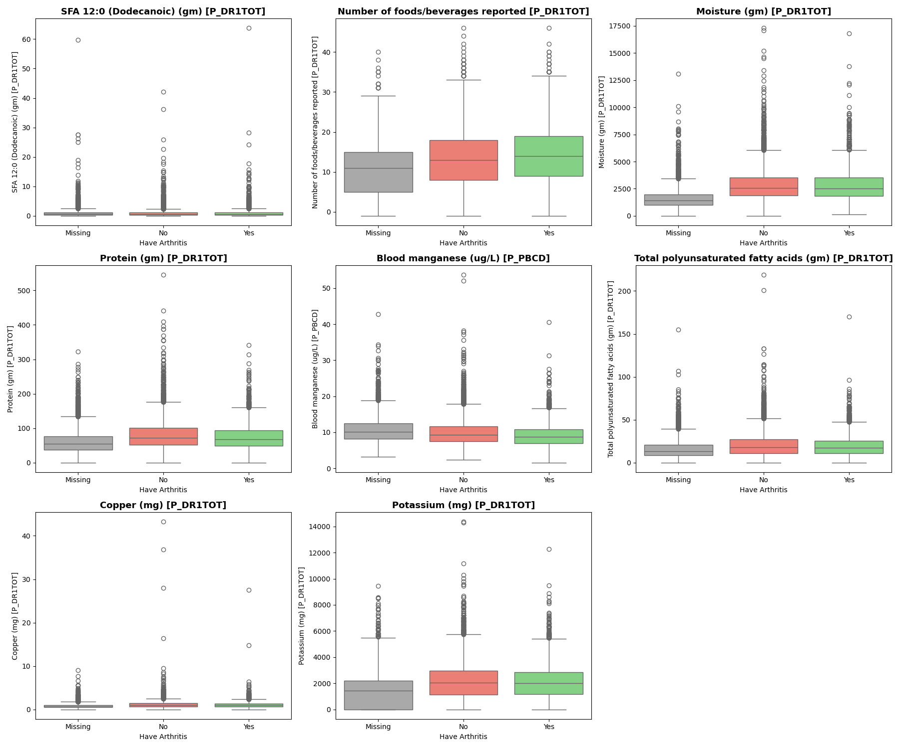
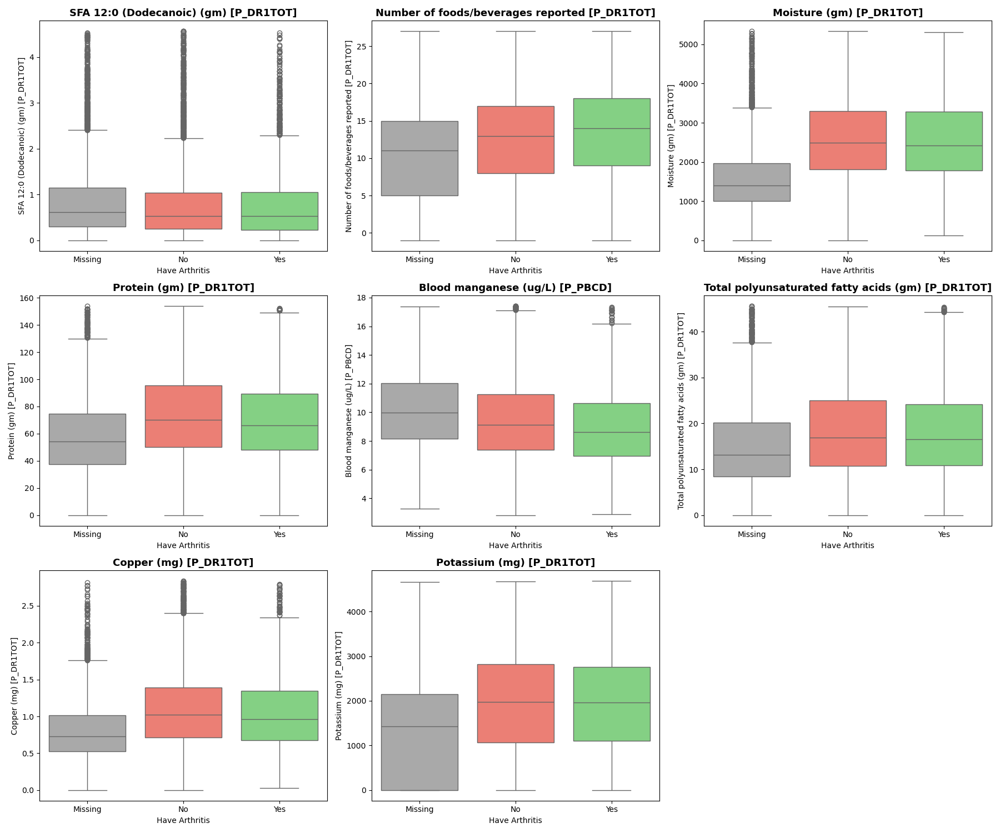

# Identifying Risk Factors for Autoimmune Conditions

**Author**: [Chisum Lindauer](chisum@atrixtech.com)

## Summary
This project aims to identify risk factors for autoimmune conditions, focusing on arthritis using the NHANES dataset (2017-2020) from the CDC, which includes data from approximately 15,000 participants. The dataset encompasses detailed demographic, dietary, laboratory, exam, and survey information.

Data preparation was extensive, involving extraction from XPT files, cleaning, encoding, and feature selection using domain knowledge and data dictionaries. Exploratory Data Analysis (EDA) was conducted iteratively, utilizing heatmaps for correlation visualization, histograms for distribution analysis, and boxplots for outlier detection and correction. The Random Forest algorithm was employed to identify important features, while XGBoost and LightGBM were tested for their performance, with XGBoost benefiting from GPU acceleration. Logistic Regression was used to assess the predictive power of features, leveraging scikit-learn for model training and statsmodels for p-value computation.

Random Forest identified key features influencing arthritis, handling missing target data effectively with -1 encoding. XGBoost demonstrated quick training times due to GPU support, whereas LightGBM, despite parameter tuning, underperformed without source compilation. Logistic Regression was used to identify features that had an effect on arthritis using p-values < .05 and was the main focus as it is the most accepted method for identifying risk factors. F1 was the metric optimized for as it provides good class 1 recall balanced with how accurate that classification is.

The results were interpreted using domain knowledge, highlighting the significant predictors of arthritis. Future improvements include developing multiple feature sets and models, employing Variance Inflation Factor (VIF) to address multicollinearity, correcting data skewness, and using Optuna to find hyperparameters. These steps can enhance the model's F1 score, giving us more accurate results.

## Reproducibility
- An `environment.yml` file is included to see all of the installed modules from conda in my environment.
- Models were stored in the `models/` directory allowing you to use and run them for yourself.
- The code uses extensive markdown and comments.
- A custom data downloader was created so that you can simply run the file and it will download files to your `data/xpt` folder. It does, however, depend on the CDC not changing their URL structure and on their website being up.

## Business Understanding
- **Goal**: Identify and provide actionable insights on the risk factors for arthritis.
- **Stakeholders**: Medical professionals, researchers, and individuals at risk of autoimmune conditions.
- **Key Business Questions**:
  1. What dietary habits are associated with arthritis risk?
  2. How do physical activity and occupational factors influence arthritis risk?
  3. What biomarkers are indicative of arthritis risk?

## Data Understanding and Analysis
- **Source of Data**: National Health and Nutrition Examination Survey (NHANES), collected by the CDC.
- **Description of Data**: The dataset includes comprehensive demographic, dietary, laboratory, examination, and survey information on 15,000 participants between 2017 and 2020.

### Visualizations
1. **Target Label Distribution Encoded**:
   
   *Description*: A survey question let people self-identify if they were diagnosed with arthritis. This is the distribution after it was encoded for -1 to be missing responses.

2. **Label and Risk Factors Correlation Matrix**:
   
   *Description*: The correlation matrix shows the highest negative and positive correlations of features identified to have a p-value < .05 with predicting arthritis.

3. **Risk Factors Continuous Data**:
   
   *Description*: Box Plots of how some selected features with p-values < .05 for predicting arthritis are distributed when grouped into each classification (missing, does not have arthritis, and does have arthritis).

   
   *Description*: Zoomed-in Box Plots above show more detail on the main distributions.

4. **Risk Factors Discrete Data**:
   
   *Description*: Bar charts showing the relationship between discrete factors such as salt intake, physical activity, and occupational stress on arthritis risk.

## Final Conclusions
The analysis identified several key risk factors for arthritis, including dietary habits, physical activity levels, and certain biomarkers. By addressing these factors, individuals can potentially reduce their risk of developing arthritis.

# Comprehensive Report on Risk Factors for Arthritis with Risk Indicators

The following analysis categorizes the identified risk factors for arthritis based on their statistical significance (p < 0.05). The factors are divided into several categories: environmental factors, known risk factors, early warning signs, ways to diagnose, and other relevant factors. For each factor, the conditions that may increase the risk of arthritis are indicated as well as a brief analysis.

## Disclaimer
While p-values are useful for identifying potential risk factors, correlation does not imply causation. Interpret these relationships with caution, and seek further validation from medical professionals. This analysis was conducted with novice domain knowledge, and findings are not definitive without expert review. More thorough examination of distributions and complex relationships is needed to determine their impact on arthritis risk, but this is a good first step.

## 1. Environmental Factors

### Behavioral and Lifestyle Factors
- **Are you now reducing salt in diet [P_MCQ]:** (Not reducing salt increases risk) High salt intake can influence inflammation and immune response, potentially contributing to arthritis.
- **Moderate recreational activities [P_PAQ]:** (Less activity increases risk) Lack of physical activity can contribute to obesity and joint stress, increasing arthritis risk.
- **SFA 12:0 (Dodecanoic) (gm) [P_DR1TOT]:** (Higher intake increases risk) Higher intake of saturated fatty acids can contribute to inflammation, though the data shows pretty similar class distributions for it on for those reporting arthritis, it is found to be predictive.
- **Number of foods/beverages reported [P_DR1TOT]:** (Lower diversity or higher quantity increases risk) Limited dietary diversity can affect inflammation and overall health. Additionally, consuming a higher quantity of certain foods might also contribute to inflammation.
- **Moisture (gm) [P_DR1TOT]:** (Lower moisture content increases risk) Lower moisture content in diet can affect hydration status, impacting joint health.
- **Protein (gm) [P_DR1TOT]:** (High intake can be beneficial) Adequate protein intake is essential for muscle and joint health, potentially reducing arthritis risk.
- **Total polyunsaturated fatty acids (gm) [P_DR1TOT]:** (Higher intake can be beneficial) Polyunsaturated fatty acids have anti-inflammatory properties.
- **Copper (mg) [P_DR1TOT]:** (Imbalance increases risk) Copper plays a role in maintaining healthy connective tissues.
- **Potassium (mg) [P_DR1TOT]:** (Adequate intake can be beneficial) Proper potassium levels are important for muscle and nerve function.

### Occupational and Environmental Exposures
- **Type of work done last week [P_OCQ]:** (Physically demanding jobs increase risk) Certain types of work can stress joints and increase arthritis risk.
- **Blood manganese (ug/L) [P_PBCD]:** (Abnormal levels increase risk) Abnormal levels of manganese can affect joint health.
- **Blood lead comment code [P_PBCD]:** (High exposure increases risk) Exposure to lead and other heavy metals can be associated with inflammatory responses.
- **Blood cadmium comment code [P_PBCD]:** (High exposure increases risk) Cadmium exposure is linked to inflammation.

## 2. Well Known Risk Factors
- **HS C-Reactive Protein (mg/L) [P_HSCRP]:** (High levels increase risk) Elevated levels of C-reactive protein are associated with inflammation, a key factor in the development and progression of arthritis.
- **Doctor ever said you were overweight [P_MCQ]:** (Yes increases risk) Obesity is a significant risk factor for arthritis.
- **Ever told you had thyroid problem [P_MCQ]:** (Yes increases risk) Thyroid dysfunction is associated with autoimmune conditions.

## 3. Possible Early Warning Signs
- **Iron, refrigerated serum (ug/dL) [P_BIOPRO]:** (Low levels increase risk) Disrupted iron metabolism can be a sign of inflammation.
- **Iron, refrigerated serum (umol/L) [P_BIOPRO]:** (Low levels increase risk) Disrupted iron metabolism can be a sign of inflammation.
- **Lactate Dehydrogenase (LDH) (IU/L) [P_BIOPRO]:** (High levels increase risk) Elevated LDH levels can indicate tissue damage.
- **Red cell distribution width (%) [P_CBC]:** (High levels increase risk) High variability in red blood cell size can indicate inflammation.
- **Monocyte number (1000 cells/uL) [P_CBC]:** (High levels increase risk) Elevated monocytes are a sign of inflammation.
- **Mean cell hemoglobin concentration (g/dL) [P_CBC]:** (Low levels increase risk) Changes can indicate anemia related to chronic disease.
- **Mean cell volume (fL) [P_CBC]:** (Low levels increase risk) Altered levels can suggest anemia.
- **Albumin, refrigerated serum (g/dL) [P_BIOPRO]:** (Low levels increase risk) Lower levels suggest chronic inflammation.
- **Blood Urea Nitrogen (mg/dL) [P_BIOPRO]:** (High levels increase risk) Indicates kidney function.
- **Potassium (mmol/L) [P_BIOPRO]:** (High or low levels increase risk) Imbalance can affect muscle and nerve function.
- **Globulin (g/dL) [P_BIOPRO]:** (High levels increase risk) Higher levels can be a marker of chronic inflammation.
- **Total Calcium (mg/dL) [P_BIOPRO]:** (High or low levels increase risk) Calcium imbalance can affect bone health.
- **Creatinine, refrigerated serum (mg/dL) [P_BIOPRO]:** (High levels increase risk) Indicates kidney function.
- **Iron frozen, Serum (umol/L) [P_FETIB]:** (Low levels increase risk) Reflects iron storage and metabolism.
- **Trouble sleeping or sleeping too much [P_DPQ]:** (Yes increases risk) Sleep disturbances are common in arthritis patients.
- **Moving or speaking slowly or too fast [P_DPQ]:** (Yes increases risk) Psychomotor changes can be associated with chronic pain and depression in arthritis.
- **Poor appetite or overeating [P_DPQ]:** (Yes increases risk) Dietary habits can influence arthritis risk.
- **Abdominal pain during past 12 months? [P_MCQ]:** (Yes increases risk) Chronic pain can be an early sign of arthritis.
- **Self-reported greatest weight (pounds) [P_WHQ]:** (High weight increases risk) Weight history can indicate risk of obesity-related arthritis.
- **Self-reported weight-age 25 (pounds) [P_WHQ]:** (High weight increases risk) Historical weight can provide insights into long-term risk factors.

## 4. Possible Diagnosis Markers
- **HS C-Reactive Protein (mg/L) [P_HSCRP]:** (High levels) Inflammation marker used in diagnosis.
- **Iron, refrigerated serum (umol/L) [P_BIOPRO]:** (Low levels) Inflammation and iron metabolism marker.
- **Lactate Dehydrogenase (LDH) (IU/L) [P_BIOPRO]:** (High levels) Tissue damage marker.
- **Albumin, refrigerated serum (g/dL) [P_BIOPRO]:** (Low levels) Chronic inflammation marker.
- **Blood Urea Nitrogen (mg/dL) [P_BIOPRO]:** (High levels) Kidney function marker.
- **Potassium (mmol/L) [P_BIOPRO]:** (High or low levels) Muscle and nerve function marker.
- **Globulin (g/dL) [P_BIOPRO]:** (High levels) Chronic inflammation marker.
- **Total Calcium (mg/dL) [P_BIOPRO]:** (High or low levels) Bone health marker.
- **Creatinine, refrigerated serum (mg/dL) [P_BIOPRO]:** (High levels) Kidney function marker.
- **Iron frozen, Serum (umol/L) [P_FETIB]:** (Low levels) Iron storage and metabolism marker.
- **Red cell distribution width (%) [P_CBC]:** (High levels) Inflammation marker.
- **Monocyte number (1000 cells/uL) [P_CBC]:** (High levels) Inflammation marker.
- **Mean cell hemoglobin concentration (g/dL) [P_CBC]:** (Low levels) Anemia marker.
- **Mean cell volume (fL) [P_CBC]:** (Low levels) Anemia marker.

## 5. Other Relevant Factors
### Demographic Factors
- **Age in years at screening [P_DEMO]:** (Older age increases risk) Age is a well-known risk factor for arthritis.
- **Gender [P_DEMO]:** (Women are at higher risk) Gender can influence arthritis risk, with women being more prone to certain types.
- **Country of birth [P_DEMO]:** (Varies) Geographical and genetic factors may play a role in arthritis prevalence.
- **Education level - Adults 20+ [P_DEMO]:** (Lower education increases risk) Lower education levels are often associated with higher arthritis risk due to socioeconomic factors.
- **Family monthly poverty level category [P_INQ]:** (Lower income increases risk) Lower socioeconomic status is associated with higher arthritis risk due to limited access to healthcare and healthy lifestyle options.

### Medical History and Screening
- **Blood ever tested for HIV virus? [P_HSQ]:** (Positive result increases risk) Indicates the history of medical screening and potential immunocompromised status.
- **Total # of Antacids Taken [P_DSQTOT]:** (Higher usage increases risk) High usage of antacids can reflect gastrointestinal issues linked to arthritis.
- **Total # of Dietary Supplements Taken [P_DSQTOT]:** (Higher usage) Supplement use can indicate attempts to manage chronic conditions.
- **Received Hepatitis A vaccine [P_IMQ]:** (Vaccination status) While not a direct risk factor, vaccination status can reflect overall health management.

### Oral Health Indicators
- **Tooth Count: #10, #12, #24, #28 [P_OHXDEN]:** (Fewer teeth increases risk) Reduced tooth count can indicate poor oral health, which is linked to systemic inflammation.
- **Coronal Caries: Tooth Count #24 [P_OHXDEN]:** (More caries increases risk) Dental caries are indicators of oral health, affecting overall health.
- **Dental Implant: yes / no? [P_OHXDEN]:** (Yes increases risk) Presence of dental implants indicates prior oral health issues.

### Family Medical History
- **Close relative had heart attack? [P_MCQ]:** (Yes increases risk) Family history of cardiovascular disease can be linked to inflammatory conditions.
- **Close relative had asthma? [P_MCQ]:** (Yes increases risk) Family history of asthma suggests a predisposition to autoimmune conditions.
- **Close relative had diabetes? [P_MCQ]:** (Yes increases risk) Family history of diabetes is linked to metabolic syndrome and inflammation.

### Self-Reported Health Conditions
- **Ever been told you have asthma [P_MCQ]:** (Yes increases risk) Asthma and other autoimmune conditions are associated with higher arthritis risk.
- **Ever had gallbladder surgery? [P_MCQ]:** (Yes increases risk) History of gallbladder issues can indicate metabolic problems.

## Next Steps

### Improvements On Project
1. **Make Additional Models with Split Features**: Develop models using different subsets of features to understand their individual contributions and improve overall model performance.
2. **Employ Variance Inflation Factor (VIF)**: Use VIF to identify and address multicollinearity in the dataset, ensuring that the features used in the models are not highly correlated.
3. **Further Test Methods to Address Skew and Imbalanced Classes**: Continue exploring advanced techniques for handling skewed distributions and imbalanced classes, such as alternative resampling methods and synthetic data generation.
4. **Use Optuna for Hyperparameter Optimization**: Implement Optuna for automated and efficient hyperparameter tuning to optimize model performance.

### Expanding The Project
1. **Analyse More Datasets**: Expand the analysis to include additional and more comprehensive datasets. This could involve integrating data from other health surveys, genetic databases, or longitudinal studies to provide a more holistic understanding of the risk factors for autoimmune conditions.
2. **Refine Models**: Continue refining the models to improve their accuracy. This includes exploring additional hyperparameter tuning, applying advanced feature engineering techniques, and experimenting with different model architectures.
3. **Investigate Unknown Environmental Factors**: Conduct in-depth investigations into the currently unknown environmental factors that may trigger autoimmune diseases. This involves examining a wide range of potential influences, such as pollutants, dietary habits, lifestyle choices, and geographical factors.
4. **Investigate Rising Prevalence of Autoimmune Disorders**: Explore why autoimmune disorders are on the rise. This could include studying trends over time, analyzing changes in environmental exposures, and investigating shifts in population health behaviors or genetic predispositions.

## For More Information
See the full analysis in the [Jupyter Notebook](./index.ipynb) or review this [presentation](./presentation.pdf).

For additional info, contact [Chisum Lindauer](chisum@atrixtech.com).