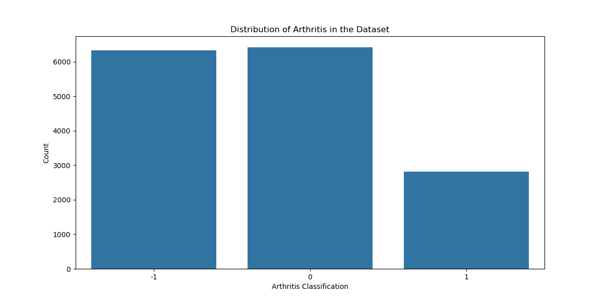

# Identifying Risk Factors for Autoimmune Conditions

**Author**: [Chisum Lindauer](chisum@atrixtech.com)

## Summary
This project aims to identify risk factors for autoimmune conditions, focusing on arthritis using the NHANES dataset (2017-2020) from the CDC, which includes data from approximately 15,000 participants. The dataset encompasses detailed demographic, dietary, laboratory, exam, and survey information.

Data preparation was extensive, involving extraction from XPT files, cleaning, encoding, and feature selection using domain knowledge and data dictionaries. Exploratory Data Analysis (EDA) was conducted iteratively, utilizing heatmaps for correlation visualization, histograms for distribution analysis, and boxplots for outlier detection and correction. The Random Forest algorithm was employed to identify important features, while XGBoost and LightGBM were tested for their performance, with XGBoost benefiting from GPU acceleration. Logistic Regression was used to assess the predictive power of features, leveraging scikit-learn for model training and statsmodels for p-value computation.

Random Forest identified key features influencing arthritis, handling missing target data effectively with -1 encoding. XGBoost demonstrated quick training times due to GPU support, whereas LightGBM, despite parameter tuning, underperformed without source compilation. Logistic Regression was used to identify features that had an affect on arthritis using p-values < .05 and was the main focus as it is the most accepted method for identifying risk factors.  F1 was the metric optimized for as it provides good class 1 recall balanced with how accurate that classification is.

The results were interpreted using domain knowledge, highlighting the significant predictors of arthritis. Future improvements include developing multiple feature sets and models, employing Variance Inflation Factor (VIF) to address multicollinearity, correcting data skewness, and using optuna to find hyper parameters. These steps can enhance the model's f1 score, giving us more accurate results.

## Business Understanding
- **Goal**: Identify and provide actionable insights on the risk factors for arthritis.
- **Stakeholders**: Medical professionals, researchers, and individuals at risk of autoimmune conditions.
- **Key Business Questions**:
  1. What dietary habits are associated with arthritis risk?
  2. How do physical activity and occupational factors influence arthritis risk?
  3. What biomarkers are indicative of arthritis risk?

## Data Understanding and Analysis
- **Source of Data**: National Health and Nutrition Examination Survey (NHANES), collected by the CDC.
- **Description of Data**: The dataset includes comprehensive demographic, dietary, laboratory, examination, and survey information on 15,000 participants between 2017 and 2020.

### Visualizations
1. **Target Label Distribution Encoded**:
   
   *Description*: A survey question let people self identify if they were diagnosed with arthritis, this is the distribution after it was encoded for -1 to be missing responses.

2. **Label and Risk Factors Correlation Matrix**:
   
   *Description*: The correlation matrix shows the highest negative and positive correlations of features identified to have a p-value < .05 with predicting arthritis.

3. **Risk Factors Continuous Data**:
   
   *Description*: Box Plots of how some selected features with p-values < .05 for predicting arthritis are distributed when grouped into each classification (missing, does not have arthritis and does have arthritis).

   
   *Description*: Zoomed in Box Plots in above so you can see more detail on the main distributions.

4. **Risk Factors Discrete Data**:
   
   *Description*: Bar charts showing the relationship between discrete factors such as salt intake, physical activity, and occupational stress on arthritis risk.

## Final Conclusions
The analysis identified several key risk factors for arthritis, including dietary habits, physical activity levels, and certain biomarkers. By addressing these factors, individuals can potentially reduce their risk of developing arthritis.

## Next Steps
To further refine the analysis and provide more comprehensive recommendations, the following next steps are suggested:
- **More Safety Analysis**: Utilize additional data sources to explore more features.
- **Market Analysis**: Identify profitable services and locations.
- **Cost Analysis**: Investigate maintenance costs, regulatory costs, and other expenses.
- **Analyze Company Strengths**: Leverage data to identify strengths in the aviation industry.
- **Expand Insights**: Delve into risk management, customer insights, and competitive analysis.

## For More Information
See the full analysis in the [Jupyter Notebook](./notebook.ipynb) or review this [presentation](./presentation.pdf).

For additional info, contact [Chisum Lindauer](chisum@atrixtech.com).
